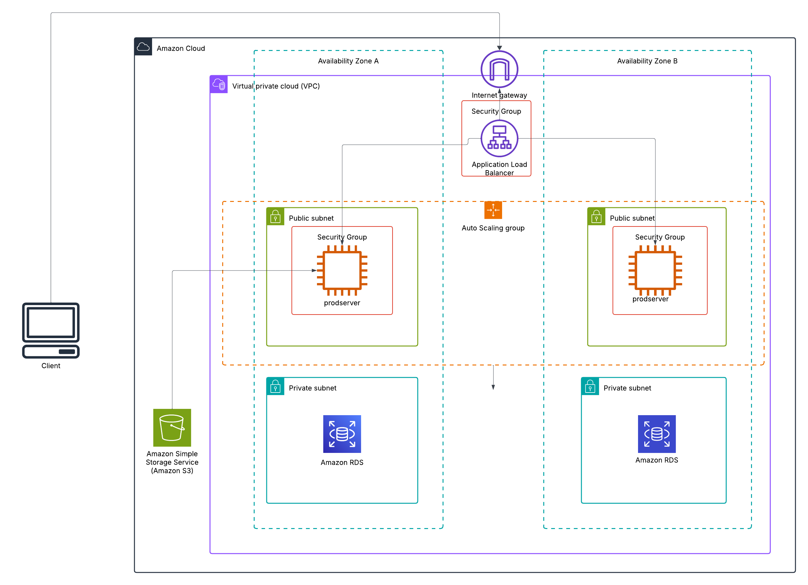

<h1>Employee_management_system</h1>
This is final graduation project for aws cloud bootcamp at neufishe.
current state : work in progress

This project demonstrates the deployment of a full-stack web application in the AWS Cloud using Terraform. The application consists of the following components:

<ol>
  <li>Frontend: React JS </li>
  <li>Backend: Spring Boot (running on EC2 instances)</li>
  <li>Database: MySQL RDS instance (in private subnet)</li>
  </ol>

<h2/>Architecture</h2>
The following AWS services are used to create the infrastructure:

<ul>
  <li>Amazon VPC: To isolate and securely network resources.</li>
  <li>Amazon S3: To host the React JS frontend as a static website.</li>
  <li>Amazon EC2: To host the Spring Boot backend application.</li>
  <li>Amazon RDS: To run the MySQL database.</li>
  <li>Amazon IAM: For securely managing access to AWS resources.</li>
  <li>Amazon Internet Gateway & NAT Gateway: For internet access for EC2 instances.</li>
  <li>Security Groups: To control traffic between frontend, backend, and database.</li>
</ul>

