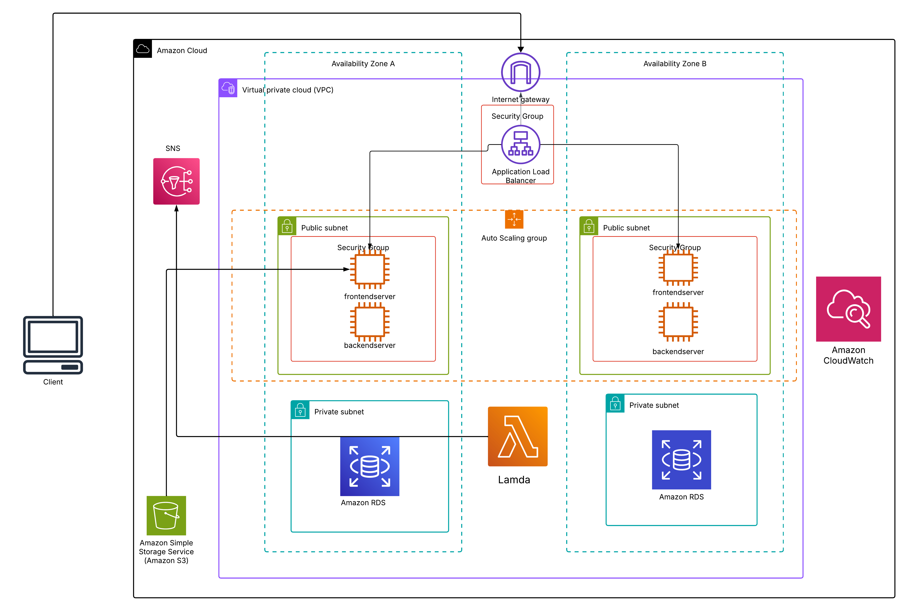

<!-- Improved compatibility of back to top link: See: https://github.com/othneildrew/Best-README-Template/pull/73 -->
<a name="readme-top"></a>
<!--
*** Thanks for checking out the Best-README-Template. If you have a suggestion
*** that would make this better, please fork the repo and create a pull request
*** or simply open an issue with the tag "enhancement".
*** Don't forget to give the project a star!
*** Thanks again! Now go create something AMAZING! :D
-->


<!-- PROJECT SHIELDS -->
<!--
*** I'm using markdown "reference style" links for readability.
*** Reference links are enclosed in brackets [ ] instead of parentheses ( ).
*** See the bottom of this document for the declaration of the reference variables
*** for contributors-url, forks-url, etc. This is an optional, concise syntax you may use.
*** https://www.markdownguide.org/basic-syntax/#reference-style-links
-->

[![LinkedIn][linkedin-shield]][linkedin-url]


<!-- PROJECT LOGO -->
<br />
<div align="center">
  <a href="https://github.com/mayuripalv/Employee_management_system">
    
  </a>

<h3 align="center">Employee Management System on AWS</h3>

  <p align="center">
    project_description
    <br />
   The Employee Management System is a web-based application designed to manage employee data such as first name, last name and email id, This system leverages AWS (Amazon Web Services) for scalable, secure, and efficient cloud-based deployment. It demonstrates how to build a CRUD (Create, Read, Update, Delete) system integrated with AWS services to manage employee information.
  </p>
</div>


<!-- TABLE OF CONTENTS -->
<details>
  <summary>Table of Contents</summary>
  <ol>
    <li>
      <a href="#about-the-project">About The Project</a>
      <ul>
        <li><a href="#built-with">Built With</a></li>
      </ul>
    </li>
    <li>
      <a href="#getting-started">Getting Started</a>
      <ul>
        <li><a href="#Architecture">Architecture</a></li>
        <li><a href="#prerequisites">Prerequisites</a></li>
        <li><a href="#installation">Installation</a></li>
      </ul>
    </li>
    <li><a href="#usage">Usage</a></li>
    <li><a href="#roadmap">Roadmap</a></li>
    <li><a href="#contributing">Contributing</a></li>
    <li><a href="#license">License</a></li>
    <li><a href="#contact">Contact</a></li>
    
  </ol>
</details>


<!-- ABOUT THE PROJECT -->
## About The Project

The Employee Management System is a scalable web-based application designed to manage employee information, such as names, positions, salaries, and attendance records. The application uses various AWS services, providing a highly available and secure infrastructure.

The system serves both frontend and backend using two EC2 instances (one for each), distributed across two availability zones for high availability. It also features public and private subnets, an Application Load Balancer (ALB), and an Auto Scaling Group (ASG) to ensure reliable performance.

<p align="right">(<a href="#readme-top">back to top</a>)</p>


### Built With

* [![React][React.js]][React-url]
* [![Spring][Spring.io]][spring-url]


<p align="right">(<a href="#readme-top">back to top</a>)</p>


<!-- GETTING STARTED -->
## Getting Started

### Architecture
   


### Prerequisites

- An AWS account with permissions to create resources (EC2, RDS, VPC, ALB, etc.).
- Basic knowledge of AWS services like EC2, RDS, ALB, and VPC.
- AWS CLI installed and configured with your credentials.
- Git for version control.

**VPC and Networking Setup**
 * Create a VPC with two public and two private subnets across two availability zones.
 * Launch an Internet Gateway and attach it to the VPC for internet access.
 * Set up route tables to direct internet traffic to public subnets.

**EC2 Instances and Auto Scaling**
 * Create EC2 instances:
 * One instance for the frontend and another for the backend.
 * Ensure they are in public subnets. 
 * Set up an Auto Scaling Group (ASG) to automatically add or remove EC2 instances based on traffic demands.

**Application Load Balancer (ALB)**
 * Create an ALB:
 * Set up target groups for the EC2 instances (frontend and backend).
 * Use listeners to route traffic to the appropriate targets based on path or hostname.

**RDS MySQL Setup**
 * Launch an Amazon RDS MySQL instance in the private subnets.
 * Create a database named employeedb for storing employee data. 
 
**Deploy Application**
 * Deploy the frontend and backend applications on their respective EC2 instances.
 * Ensure security groups are configured to allow ALB traffic to the EC2 instances and database connections between the backend and RDS instance.

**DNS with Route 53 (Future Enhancement)**
 * Set up Amazon Route 53 to manage DNS records for the application.
 * Create a hosted zone and configure routing to point to your ALB or specific EC2 instances.

**AWS Lambda (Future Enhancement)**
 * Use AWS Lambda for serverless functionalities like sending automated emails, taking periodic backups, or integrating with other services.


### Installation


1. Clone the repo
   ```sh
   git clone https://github.com/mayuripalv/frontend-demo-aws-terraform-shrikant-1.git
   ```
2. Create a non root user
   ```sh
   ssh -i /home/mayuri/ec2-key.pem ubuntu@IP_BACKEND_SERVER
   sudo -i
   adduser spring
   usermod -aG sudo spring
   su - spring
   ```

## Run bash shell script to Install: 
- Java 17 and Maven for spring-backend, 
- Nodesjs for front-end, 
- Nginx

3. run bash shell script
   ```sh
   vim prod.sh
   ---------------------
   #!/bin/bash
   sudo apt-get update 

   #Install Java 17
   sudo apt install openjdk-17-jdk openjdk-17-jre -y 
   #Install Maven
   sudo apt install maven -y

   #Install Nodejs
   curl -fsSL https://deb.nodesource.com/setup_current.x | sudo -E bash - &&\
   sudo apt-get install -y nodejs 

   #Install and configure Nginx
   sudo apt install nginx -y
   sudo ufw enable
   sudo ufw allow 'Nginx Full'   #(port 80 and potentially 443 for HTTPS)
   sudo ufw allow 8080 #(for the Spring backend).
   sudo ufw allow 3000
   sudo ufw allow 22    #allow incoming traffic on SSH
 
   #Install and configure Cerbot
   sudo snap install core; sudo snap refresh core
   sudo snap install --classic certbot
   #Link the certbot command from the snap install directory to our path, so you can run it by just running certbot
   sudo ln -s /snap/bin/certbot /usr/bin/certbot

   ----------------------
   bash prod.sh

   ```

4. Configure Backend App
 - Clone source code — Build jar file— Connect backend to RDS — ReBuild jarfile — Run backend-app
   ```sh
   git clone https://github.com/mayuripalv/frontend-demo-aws-terraform-shrikant-1.git

   #build and install Maven projects
   cd /frontend-demo-aws-terraform-shrikant-1/employeemanagmentbackend
   mvn clean install -DskipTests

   #Connect backend app to RDS
   cd src/main/resources/
   vim application.properties
   (update spring.datasource.url=jdbc:mysql://paste_rds_endpoint_here/db_name, update username and password)

   #Rebuild and install Maven projects
   cd ../../../
   mvn clean install -DskipTests

   #RUN Backend-app
   cd target/
   ls
   java -jar employee................-SNAPSHOT.jar
   ``` 
 - Access backend-app on browser >>> IP_BACKEND_Server:8080/employee  

5. Configure Frontend App :
 - Open another terminal and ssh to frontend_Server:
   ```sh
   
   ssh -i /frontend-demo-aws-terraform-shrikant-1/ec2-key.pem ubuntu@IP_Full_Stack_Server
   su - spring

   # Connect backend-app to frontend
   cd /frontend-demo-aws-terraform-shrikant-1/employeemanagement-frontend
   cd src/service
   vim EmployeeService.js
   update BASE_URL = "http://IP_backend_Server:8080/employee";

   #BUILD FrontEnd APP
   cd ../../
   npm install

   #Run FrontEnd APP
   npm start

   ``` 
 - Access Frontend-app on browser >>> IP_Frontend_Server:3000  

6. Run the backend-app in background using systemd
   ```sh
   sudo nano /etc/systemd/system/spring.service

   >>>Update jar file path and User
   ------------------------

   [Unit]
   Description=Spring init sample
   After=syslog.target
   [Service]
   User= spring
   Restart=always
   RestartSec=30s
   ExecStart=/usr/bin/java -jar /home/spring/frontend-demo-aws-terraform-shrikant-1/employeemanagmentbackend/target/employeemanagmentbackend-0.0.1-SNAPSHOT.jar SuccessExitStatus=143
   [Install]
   WantedBy=multi-user.target

   ---------------------

   sudo systemctl enable spring.service
   sudo systemctl start spring.service
   sudo systemctl status spring.service

   #sudo systemctl stop spring.service
   #sudo systemctl restart spring.service

   ``` 

7. Setting up nginx to serve frontend application and proxying requests to both the frontend application and backend Spring application.
   ```sh
   #Already Install and configure NGinx in script prod.sh
   >>> Access Nginx on Browser : IP_Full_Stack_Server


   #Generate static files that can be served by nginx.(asset-manifest.json index.html static/)
   cd employee-app/employeemanagement-frontend
   npm run build
   ls

   #Prepare nginx to serve the frontend app:
   #Create a directory /var/www/front to host your frontend files we just generated.
   cd /var/www 
   sudo mkdir front
   cd
   cd /frontend-demo-aws-terraform-shrikant-1/employeemanagement-frontend/build
   sudo cp -r asset-manifest.json index.html static/ /var/www/front

   #Create nginx server block for backend app and frontend app:
   cd /etc/nginx/sites-available

   #create a new server block configuration file (e.g., spring) for Full-stack-app
   sudo vim spring
   -------------------

   server {
   listen 80;
   server_name  frontend_server_ip;   # update DNS

   location / {
   root /var/www/front;
   index  index.html index.htm;
   proxy_http_version 1.1;
   proxy_set_header Upgrade $http_upgrade;
   proxy_set_header Connection 'upgrade';
   proxy_set_header Host $host;
   proxy_cache_bypass $http_upgrade;
   try_files $uri $uri/ /index.html;
   }
   }
   server {
   listen 80;
   server_name backend_server_ip;   # update DNS
   location / {
   proxy_pass http://44.223.30.0:8080; #update with IP_backend_Server
   proxy_http_version 1.1;
   proxy_set_header Upgrade $http_upgrade;
   proxy_set_header Connection 'upgrade';
   proxy_set_header Host $host;
   proxy_cache_bypass $http_upgrade;
    }
   }

    ---------------------------

   sudo nginx -t

   #Create a symlink to enable the newly created server block.
   sudo ln -s /etc/nginx/sites-available/spring /etc/nginx/sites-enabled/spring

   #Restart nginx to apply the configuration changes.
   sudo systemctl restart nginx

   ```


<p align="right">(<a href="#readme-top">back to top</a>)</p>


<!-- USAGE EXAMPLES -->
## Usage

* The Employee Management System allows users to manage employee data through a web interface (hosted on the frontend EC2 instance) or via APIs (hosted on the backend EC2 instance).

**API Endpoints**

| Method     | Endpoint           | Description     |
| :---       |    :----:          |          ---: |
| GET        | /employee         | Get all employees   |
| POST       | /employee         | Add a new employee    |
| PUT        | /employee/{id}    | Update an existing employee   |
| DELETE     | /employee/{id}    | Delete an employee by ID     |


<p align="right">(<a href="#readme-top">back to top</a>)</p>


<!-- ROADMAP -->
## Roadmap

- [ ]  VPC Setup

    * Create public and private subnets across two availability zones.
    * Set up an Internet Gateway for public subnet traffic.
- [ ] EC2 Instances

    * Set up two EC2 instances (one for frontend, one for backend) in different public subnets.
    * Enable security groups for controlled access to EC2 instances.
- [ ] Application Load Balancer (ALB)

    * Configure ALB to distribute traffic between EC2 instances.
    * Set up listeners and target groups for frontend and backend traffic.
- [ ] Auto Scaling Group (ASG)

    * Configure Auto Scaling for EC2 instances based on traffic demands.
- [ ] Amazon RDS (MySQL)

    * Deploy RDS in private subnets with Multi-AZ for high availability.
    * Configure database connections between backend EC2 and RDS.


<p align="right">(<a href="#readme-top">back to top</a>)</p>


<!-- CONTRIBUTING -->
## Contributing

Contributions are what make the open source community such an amazing place to learn, inspire, and create. Any contributions you make are **greatly appreciated**.

If you have a suggestion that would make this better, please fork the repo and create a pull request. You can also simply open an issue with the tag "enhancement".
Don't forget to give the project a star! Thanks again!

1. Fork the Project
2. Create your Feature Branch (`git checkout -b feature/AmazingFeature`)
3. Commit your Changes (`git commit -m 'Add some AmazingFeature'`)
4. Push to the Branch (`git push origin feature/AmazingFeature`)
5. Open a Pull Request

<p align="right">(<a href="#readme-top">back to top</a>)</p>


<!-- LICENSE -->
## License

Distributed under the MIT License. See `LICENSE.txt` for more information.

<p align="right">(<a href="#readme-top">back to top</a>)</p>


<!-- CONTACT -->
## Contact

Your Name - [Mayuri palve] - mayuripalve55@gmail.com

Project Link: [https://github.com/mayuripalv/Employee_management_system.git](https://github.com/mayuripalv/Employee_management_system.git)

<p align="right">(<a href="#readme-top">back to top</a>)</p>


<!-- MARKDOWN LINKS & IMAGES -->
<!-- https://www.markdownguide.org/basic-syntax/#reference-style-links -->
[contributors-shield]: https://img.shields.io/github/contributors/github_username/repo_name.svg?style=for-the-badge
[contributors-url]: https://github.com/github_username/repo_name/graphs/contributors
[forks-shield]: https://img.shields.io/github/forks/github_username/repo_name.svg?style=for-the-badge
[forks-url]: https://github.com/github_username/repo_name/network/members
[stars-shield]: https://img.shields.io/github/stars/github_username/repo_name.svg?style=for-the-badge
[stars-url]: https://github.com/github_username/repo_name/stargazers
[issues-shield]: https://img.shields.io/github/issues/github_username/repo_name.svg?style=for-the-badge
[issues-url]: https://github.com/github_username/repo_name/issues
[license-shield]: https://img.shields.io/github/license/github_username/repo_name.svg?style=for-the-badge
[license-url]: https://github.com/github_username/repo_name/blob/master/LICENSE.txt
[linkedin-shield]: https://img.shields.io/badge/-LinkedIn-black.svg?style=for-the-badge&logo=linkedin&colorB=555
[linkedin-url]: https://www.linkedin.com/in/mayuri-palve/
[product-screenshot]: images/screenshot.png
[Next.js]: https://img.shields.io/badge/next.js-000000?style=for-the-badge&logo=nextdotjs&logoColor=white
[Next-url]: https://nextjs.org/
[React.js]: https://img.shields.io/badge/React-20232A?style=for-the-badge&logo=react&logoColor=61DAFB
[React-url]: https://reactjs.org/
[Vue.js]: https://img.shields.io/badge/Vue.js-35495E?style=for-the-badge&logo=vuedotjs&logoColor=4FC08D
[Vue-url]: https://vuejs.org/
[Spring.io]: https://img.shields.io/badge/spring-20232A?style=for-the-badge&logo=spring&logoColor=61DAFB
[Spring-url]:https://spring.io/
[Bootstrap.com]: https://img.shields.io/badge/Bootstrap-563D7C?style=for-the-badge&logo=bootstrap&logoColor=white
[Bootstrap-url]: https://getbootstrap.com
